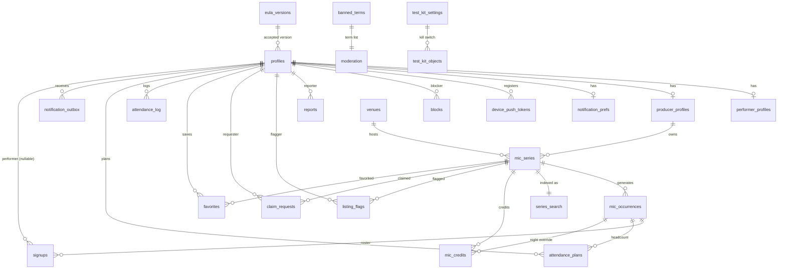
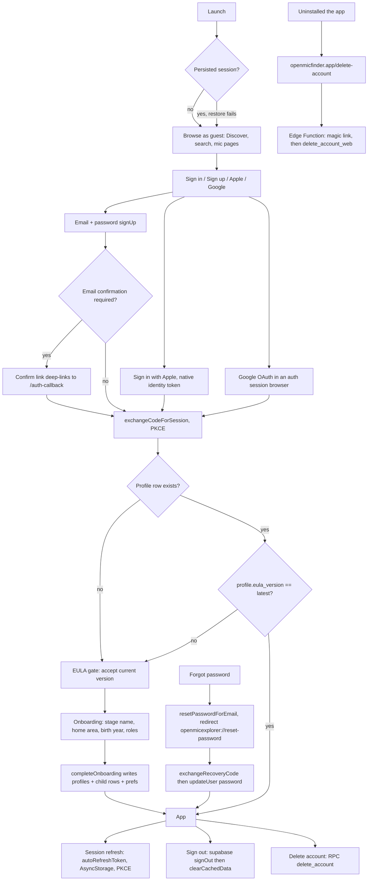

# REPO-MAP: Open Mic Explorer

Structural truth as of commit `564088c` on branch `claude/open-mic-discovery-audit-6yqttz`, read-only audit, 2026-08-07.

Everything here is what the code does. Opinions live in FINDINGS.md and PLAN.md.

---

## 1. Ground truth

| Thing | Value | Evidence |
| --- | --- | --- |
| Expo SDK | `~57.0.9` | `package.json:26` |
| React Native | `0.86.2` | `package.json:47` |
| React | `19.2.3` | `package.json:45` |
| TypeScript | `~6.0.3`, `strict: true`, no `any` (lint error) | `package.json:80`, `tsconfig.json:4`, `eslint.config.js:15` |
| Package manager | npm (`package-lock.json` present, `npm ci` in CI) | `.github/workflows/ci.yml:26` |
| Node | 22 in CI, "Node 22+" in the README | `.github/workflows/ci.yml:22`, `README.md:9` |
| Bundle identifier | `com.openmicexplorer.app` (iOS and Android both) | `app.json:12`, `app.json:115` |
| App version | `1.0.0`; build numbers come from EAS (`appVersionSource: remote`, `autoIncrement` on testflight and production) | `app.json:5`, `eas.json:4`, `eas.json:23`, `eas.json:27` |
| EAS project | `b44e6a07-5276-481b-9679-8e3e1e681692`, owner `kylem_ix` | `app.json:196`, `app.json:199` |
| Android target | `compileSdk 36`, `targetSdk 36` | `app.json:143` |
| iOS floor | deployment target `16.4` | `app.json:148` |
| Scheme | `openmicexplorer://`, associated domain `openmicfinder.app` | `app.json:8`, `app.json:14` |
| Migrations | 55 forward, 2 down scripts | `supabase/migrations/`, `supabase/migrations/down/` |
| Tests | 68 Jest files (478 tests), 33 pgTAP files (439 planned assertions), 3 Maestro flows | `src/**/*.test.ts*`, `supabase/tests/`, `e2e/` |

### EAS build profiles

| Profile | Distribution | Channel | Notes |
| --- | --- | --- | --- |
| `development` | internal | development | dev client |
| `preview` | internal | preview | Android APK, `environment: preview` |
| `testflight` | store | preview (inherited) | extends preview, `autoIncrement` |
| `production` | store default | production | `autoIncrement` |

Source: `eas.json:5-30`. Note that `testflight` extends `preview` and therefore inherits `channel: preview` and `environment: preview`, not production. That is a real behaviour, not necessarily a defect: see FINDINGS F-018.

### Dependency health

No dependency in `package.json` is deprecated or incompatible with SDK 57. Every `expo-*` package is pinned to a `~57.0.x` range, `react-native-reanimated 4.5.1` and `react-native-worklets 0.10.1` move together as ARCHITECTURE.md requires (`package.json:49`, `package.json:53`).

`eslint.config.js:17` carries an `import/no-unresolved` exception for `react-native-purchases`, a package that is not in `package.json` at all. It is a leftover from a removed dependency, harmless, listed in FINDINGS as Low.

`npm audit` reports 34 advisories (30 moderate, 4 high). All four high advisories reach the tree through `@supabase/postgres-meta` (a devDependency) and lint tooling. None ship in the app bundle. Detail in FINDINGS F-015.

---

## 2. Navigation tree

Expo Router, file-based, typed routes on (`app.json:190`). Root is `src/app/`.

```
_layout.tsx                       root: PersistQueryClient > Session > Theme > Toast > AuthGate > Stack
├── (tabs)/_layout.tsx            bottom tabs
│   ├── index.tsx                 Discover (map + ranked list + search)
│   ├── favorites.tsx             Favorites
│   ├── going.tsx                 Going (signups and attendance plans)
│   ├── producer.tsx              My Mics
│   └── profile.tsx               Profile
├── (auth)/_layout.tsx            auth stack
│   ├── sign-in.tsx
│   ├── sign-up.tsx
│   ├── forgot-password.tsx
│   ├── reset-password.tsx        headerBackVisible false, keeps its recovery session
│   ├── eula.tsx                  acceptance gate, headerBackVisible false
│   └── onboarding.tsx            profile setup, headerBackVisible false
├── mic/[id].tsx                  public mic detail, signup footer, report, flag, claim
├── producer/
│   ├── new.tsx                   create listing
│   ├── [id].tsx                  manage one series
│   ├── night/[occurrenceId].tsx  the night roster, walk-ins, draw, report a performer
│   ├── live/[occurrenceId].tsx   run the show
│   ├── credits/[id].tsx          host and featured artist credits
│   └── analytics/[id].tsx        series analytics
├── settings.tsx                  support, blocked users, delete account
├── edit-profile.tsx
├── notification-prefs.tsx
├── privacy.tsx                   reachable in every auth state
├── terms.tsx
├── admin.tsx                     moderation queue, admin gated
├── test-kit.tsx                  testing tools, admin gated
└── auth-callback.tsx             PKCE code exchange for email confirm and Google
```

Only two `Stack.Screen` entries are declared at the root (`src/app/_layout.tsx:202-203`); every other route is picked up by the file globber. Nothing is orphaned: each of the 29 route files is reachable from a tab, a link, or a deep link. `src/app-routes.test.ts` is a standing guard that no `*.test.tsx` file lands under `src/app`, because such a file becomes a real route and crashes the bundle while Jest still reports green.

### Auth routing rules

`AuthGate` in `src/app/_layout.tsx:49-153` is the single decision point.

| State | Behaviour |
| --- | --- |
| No session | Browsing is fully open. Discover, search, and mic pages read signed out. Only `eula` and `onboarding` bounce back to the tabs. |
| Session, no profile row | Redirect to `/(auth)/eula`, except `privacy`. The pre-auth path is recorded via `setReturnTo` so a shared link is not lost. |
| Profile on an older EULA | Redirect to `/(auth)/eula` to re-accept. |
| Fully onboarded, inside `(auth)` | Redirect to the recorded return path, or the tabs. `reset-password` is exempt so the recovery session survives. |
| Profile or EULA query errored | A "Connection trouble" screen with a retry, not a spinner. |

`ErrorBoundary` at `src/app/_layout.tsx:166-182` is the last line of defence and reports to Sentry.

---

## 3. Dual-role model, end to end

This is the part most likely to be misread, so it is stated plainly.

**Roles are a self-service preference, not a privilege boundary.**

- Storage: `profiles.is_performer`, `profiles.is_producer`, `profiles.is_admin` (`supabase/migrations/20260728000200_profiles.sql:24-26`), plus optional child rows `performer_profiles` and `producer_profiles`.
- Assignment at signup: the client writes both booleans directly in `completeOnboarding` (`src/features/auth/api.ts:217-265`).
- Assignment later: the client writes them directly again, from Edit profile (`src/features/profile/queries.ts:101-103`) and from one-tap enablement paths (`src/features/profile/queries.ts:64-67`, `src/features/producer/queries.ts:511-513`).
- RLS: the `profiles owner update` policy permits the owner to write their own row (`supabase/migrations/20260728000200_profiles.sql:103-106`). The `guard_profile_writes` trigger pins `is_admin`, `moderation_status`, and `eula_accepted_at` (`supabase/migrations/20260728001000_moderation.sql:43-78`). It does **not** pin `is_performer` or `is_producer`.

So any authenticated user can set `is_producer = true` on themselves. That is intentional, because the actual authority checks never consult the role:

| Action | What actually gates it |
| --- | --- |
| Create a listing | `series authenticated insert`: `created_by = auth.uid()` only (`20260728000300_venues_series.sql:137-142`). No producer check. |
| Edit or cancel a night | `owns_occurrence_series(occurrence_id)`, an ownership check on the series (`20260728000400_occurrences_signups.sql:243-258`). |
| Draw a lottery, reorder slots, mark on deck, end a show | Same ownership check, inside the SECURITY DEFINER RPC body. |
| Moderate content, review a claim, use the test kit | `private.is_admin()`, which cannot be self-granted. |
| Join a signup list | `signups performer insert` does require `p.is_performer` (`20260728000900_signups.sql:68-71`), but self-granting it only unlocks an action against yourself. |

`is_admin` is the only real privilege, and it is protected two ways: the profile guard pins it on every user write, and the only path that sets it is the owner-email bootstrap trigger (`20260801000100_test_kit.sql:55-73`).

---

## 4. Data model

Every table in `public` has row level security enabled. That is asserted by a pgTAP test that names any offender (`supabase/tests/grants-and-rls.test.sql:51-60`).



### Core tables

**`profiles`** (`20260728000200_profiles.sql:15`, extended by `001300`, `001400`, `20260730000300`, `20260801001000`)
Identity plus private home area. `handle` is a `citext` with a format check and a unique index. `stage_name` is the public identity; `display_name` is private. `home_city`, `home_region`, `home_postal_code`, `home_lat`, `home_lng`, `home_location`, and `birth_year` are private, owner-read only. A check constraint requires city plus region, or a ZIP, unless the row is soft-deleted (`20260728001400_home_area.sql:25-29`). A trigger mirrors lat and lng into the PostGIS `home_location` column.

**`venues`** (`20260728000300_venues_series.sql:3`)
`location geography(point, 4326) not null`, GiST indexed. Tri-state accessibility and amenity booleans (null means unknown). Soft delete, moderation status.

**`mic_series`** (`20260728000300_venues_series.sql:76`)
The recurring definition. The RRULE string carries only the date pattern; `start_time` is a bare `time`, `timezone` is an IANA name validated against `pg_timezone_names` by a trigger (`:113-126`), and `anchor_date` fixes biweekly parity. `starts_at` for an occurrence is computed as `(local_date + start_time) at time zone timezone`, which is DST-correct by construction. Nothing naive is stored.

**`mic_occurrences`** (`20260728000400_occurrences_signups.sql:4`)
Materialised rolling window, `unique (series_id, local_date)`. No insert policy for API roles at all: rows arrive only through the SECURITY DEFINER generator or the service role.

**`signups`** (`20260728000400_occurrences_signups.sql:207`, amended by `20260803000200_walk_ins.sql`)
A row is either an account signup (`performer_id`) or a walk-in guest (`guest_name`), never both, enforced by `check ((performer_id is null) <> (guest_name is null))`. Status and slot position are set by the `signup_lifecycle` trigger, never by the client. On update the trigger pins `occurrence_id`, `performer_id`, `guest_name`, and `created_at`.

**`series_search`** (`20260807000200_search_surface.sql:50`)
One weighted `tsvector` plus an unaccented trigram string per series, maintained by triggers on `mic_series`, `venues`, and `profiles`. Its select policy is unconditional `true`, deliberately: presence in the table *is* the access control, because the sync function only ever writes rows for publicly visible listings and deletes the row the moment that stops being true (`:60-74`). The reason given is measured: a row-condition policy forbids the GIN index as an index condition and turns every search into a sequential scan.

### Recurrence: what is actually supported

`private.rrule_matches` (`20260728000400_occurrences_signups.sql:61-130`) supports exactly two shapes:

- `FREQ=WEEKLY;INTERVAL=n;BYDAY=MO..SU`, with parity computed per ISO week (Monday-based) relative to `anchor_date`.
- `FREQ=MONTHLY;BYDAY=1TU,3TU,-1FR`, ordinal weekday of the month, positive and negative ordinals.

The producer UI can only emit a subset of that: weekly, biweekly, and monthly-by-ordinal (`src/features/producer/rrule-builder.ts:17-37`). Against RFC 5545, for the rules the app actually generates, the semantics are correct: WKST defaults to MO in the RFC and `date_trunc('week', ...)` is Monday-based, so biweekly parity matches. `COUNT`, `UNTIL`, `BYMONTHDAY`, `BYSETPOS`, and `FREQ=DAILY` are unsupported and unreachable from the UI. Two gaps that are unreachable today but silent if ever reached are recorded as F-014.

Generation is idempotent by construction: `insert ... on conflict (series_id, local_date) do nothing` (`:174`). Edits reconcile rather than append, and never remove a night a human touched (`20260728000800_producer.sql:38-91`).

### Geo queries

`venues.location` carries a GiST index (`20260728000300_venues_series.sql:25`). `search_discover` uses `st_dwithin` for the radius bound and half-life distance decay for ranking (`20260807000300_search_discover.sql:258`, `:280`). Distances rank on the sphere, not the spheroid, deliberately.

`profiles.home_location` has **no** index, and two cron jobs run `st_dwithin` against every profile row (`20260728001100_retention.sql:60`, `:91`). See F-008.

---

## 5. Row level security, table by table

Read this as: "policy name, what it lets through, in plain words".

| Table | Policies | Plain reading |
| --- | --- | --- |
| `eula_versions` | select `true` to anon and authenticated | Everyone reads the terms. No write policy: versions land via migration only. |
| `profiles` | owner select/insert/update; admin select/update | Non-owners cannot read the base table at all. No delete policy. Owner update requires `deleted_at is null`. |
| `performer_profiles`, `producer_profiles`, `notification_prefs`, `device_push_tokens`, `favorites`, `attendance_log` | owner `for all` on `profile_id = auth.uid()` | Strictly personal rows. `producer_profiles` adds an admin select. |
| `venues` | public select (approved and not deleted); admin select; creator select own pending; authenticated insert with `created_by = auth.uid()`; creator or admin update | Anyone signed in can add a venue. Moderation status is pinned by trigger. |
| `mic_series` | public select (approved, not deleted); admin select; stakeholder select; authenticated insert with `created_by = auth.uid()`; owner update, with a WITH CHECK that forbids assigning ownership to someone else | Ownership transfer goes through the claim workflow. |
| `mic_occurrences` | public select via the parent series; stakeholder select; owner update. **No insert policy.** | Nights are server-generated only. |
| `signups` | performer selects own; producer selects the nights they own; performer insert (self, unblocked, is_performer, window open, not host_booked); performer delete own; producer update; producer guest insert and delete | A performer can never update a signup, only create and withdraw. Guest rows are producer-only in both directions. |
| `blocks` | owner select/insert/delete on `blocker_id` | You see only your own blocks. `blocked_display_name` is snapshotted by trigger so the unblock list stays readable. |
| `reports` | reporter insert (self, status open); reporter or admin select; admin update | |
| `listing_flags` | flagger insert (self, open); flagger or admin select; series owner select; admin update | |
| `claim_requests` | requester or admin select; requester insert only against an unowned live series; admin update | |
| `banned_terms` | admin select/insert/delete | |
| `mic_credits` | series-owner writes; public reads through `mic_credit_public` | |
| `attendance_plans` | owner select; producer counts via a view | |
| `series_search` | select `true`, no write policies | See the note above. |
| `notification_outbox` | RLS on, **zero policies** | Default-deny for every API role. Service role only. Asserted by test. |
| `test_kit_settings`, `test_kit_objects` | admin select only, no write policies | Writes go through the guarded definer functions. |
| `private.rate_limit_counters` | RLS on, in the `private` schema, never API-exposed | |

**Policies using `true`:** exactly two. `eula_versions` (correct: the terms are public) and `series_search` (justified in the migration header, and the visibility rule is enforced on write instead). No policy grants more than it appears to.

**Grants:** `20260728001200_grants.sql:12` issues `grant all on all tables in schema public to anon, authenticated, service_role` and extends it to future objects with `alter default privileges`. RLS is therefore not a second layer, it is the only layer. The repo knows this and tests it: `supabase/tests/grants-and-rls.test.sql` creates a probe table inside a rolled-back transaction to prove that a new table would be world-writable, and names any table missing RLS. That guard does not extend to views (F-007).

---

## 6. RPCs and Edge Functions

### Public-schema functions callable over the API

| Function | Definer | search_path | Internal authorization | Anon callable |
| --- | --- | --- | --- | --- |
| `search_discover` | invoker | `public` | RLS on base tables | yes, intended |
| `mics_near` | invoker | `public` | RLS on base tables | yes, dead code (F-006) |
| `search_mics` | invoker | `public` | RLS on base tables | yes, dead code, does not filter `is_active` (F-006) |
| `signup_counts` | definer | `''` | Restricted to approved, live series; returns counts only, no names | yes, intended |
| `delete_account` | definer | `''` | `auth.uid()` must be non-null | yes, but no-ops for anon |
| `delete_account_web` | definer | `''` | service_role or postgres only, and `revoke ... from public, anon, authenticated` | no |
| `deletion_request_allowed` | definer | `''` | service_role or postgres only, explicitly revoked | no |
| `moderate_content` | definer | `''` | `private.is_admin()` | granted to authenticated, refuses non-admins |
| `review_claim` | definer | `''` | `private.is_admin()` | same |
| `resolve_flag` | definer | `''` | `private.is_admin()` | same |
| `draw_lottery`, `set_slot_order`, `mark_on_deck`, `end_show` | definer | `''` | `owns_occurrence_series()` or `is_admin()` | same |
| `my_waitlist_rank` | definer | `''` | Filters on `auth.uid()` in the body | authenticated only |
| `test_kit_*` (8 functions) | definer | `''` | Every one calls `private.test_kit_guard()`, which requires `is_admin()` **and** the kill switch | authenticated, refuses non-admins |

Every SECURITY DEFINER function in the repo pins `search_path`, with one exception: `private.set_updated_at` (`20260728000100_extensions_and_types.sql:28`), which is not SECURITY DEFINER and touches no tables. Recorded as F-013.

### Edge Functions

**`deletion-request`** (`supabase/functions/deletion-request/index.ts`), `verify_jwt = false` by design (the page has no session).
`action: "request"` sends a magic link with `shouldCreateUser: false` and returns an identical response whether or not the account exists, so it cannot be used to probe. Rate limited 3 per email per hour and 10 per IP per hour through `deletion_request_allowed`, keyed on salted SHA-256 hashes. `action: "confirm"` validates the token with the service client, best-effort removes the avatar objects, then calls `delete_account_web`. Both deletion paths run the identical `private.delete_account_for` body, and a pgTAP test proves the end states match.

**`push-sender`** (`supabase/functions/push-sender/index.ts`), drains `notification_outbox` to Expo. Invoked every minute by pg_cron plus pg_net through `private.invoke_push_sender`, which reads its URL and token from Supabase Vault so no secret lives in a migration (`20260803000700_push_sender_schedule.sql:11-45`). A duplicate schedule was later removed (`20260806000200:58-73`).

### Storage buckets

| Bucket | Public | Policies |
| --- | --- | --- |
| `avatars` | yes | Anyone reads. Insert, update, and delete restricted to `(storage.foldername(name))[1] = auth.uid()::text` (`20260728001300:98-125`). |
| `posters` | yes | Identical pattern (`20260728001500:124-151`). |

Both are public-read by design: avatars and posters are public content like display names. Writes are folder-scoped to the owner.

---

## 7. Auth lifecycle



Client details: `src/lib/supabase.ts:15-23` (AsyncStorage, `autoRefreshToken`, `persistSession`, `detectSessionInUrl: false`, `flowType: 'pkce'`), `src/features/auth/session.tsx` (a corrupt persisted session resolves to signed-out rather than hanging on the boot spinner), `src/features/auth/api.ts` (every GoTrue error is translated; no raw server string reaches a screen).

Password policy: minimum 10 characters, enforced client side (`src/features/auth/validation.ts:19-22`) and mirrored in `supabase/config.toml` `minimum_password_length = 10` so the policy holds for callers that skip the app.

Sign-out clears both the query cache and the persisted cache (`src/lib/query-client.ts:48-51`), because the persisted rows include home coordinates, birth year, and for admins the moderation queue.

---

## 8. State, data fetching, caching

- **Server state:** TanStack Query v5, one `QueryClient` (`src/lib/query-client.ts:25-33`), `staleTime` 60s, `gcTime` 24h, `retry: 2`.
- **Persistence:** `PersistQueryClientProvider` with an AsyncStorage persister, `maxAge` 24h, and a manual `CACHE_BUSTER` string that must be bumped whenever a migration changes the shape of anything cached. The comment records the crash that motivated it.
- **Client state:** Zustand, four small stores: `filters`, `recent-searches`, `onboarding`, `return-to`.
- **Realtime:** every subscription gets a unique channel topic (`src/lib/realtime.ts`) to sidestep supabase-js returning an already-joined channel on remount.
- **Offline:** `OfflineBanner` (`src/components/offline-banner.tsx`) is mounted on Discover, Favorites, Going, and the mic detail page, and says the content shown is cached rather than hiding it.

**Places the client trusts data it should not:** none found. Every field a client must not choose is pinned server side by a trigger: signup status and slot position, moderation status, `is_admin`, `eula_accepted_at`, `verified`, `last_confirmed_at` and `last_confirmed_by`, and the blocked-name snapshot. The client sends its intent and the database decides.

---

## 9. Forms and validation

| Form | Client validation | Server validation |
| --- | --- | --- |
| Sign up | email shape, password length 10 (`src/features/auth/validation.ts`) | GoTrue email shape, `minimum_password_length = 10` in config |
| Onboarding | stage name, birth year with an 18 gate, home area, at least one role | `profiles_age_gate` trigger (18, hard failure), `profiles_home_area_present` check constraint, handle format check, `display_name` length check |
| Edit profile | social handle and URL normalisation (`src/features/profile/social.ts`) | Four column check constraints on handle shape and `https://` prefix, `bio` length 500 |
| Create or edit listing | `src/features/producer/components/series-form.tsx`, RRULE built from choices, timezone derived from the pin | title 1..120, description 2000, `cardinality(disciplines) > 0`, `cost_cents >= 0`, `capacity > 0`, IANA timezone trigger, banned-term filter |
| Add a walk-in | name required | `guest_name` length 1..80, the performer-xor-guest check constraint, producer-only insert policy |
| Report | reason required, details optional | `details` length 1000, `reporter_id = auth.uid()`, `status = 'open'`, 5 per hour rate limit |
| Flag a listing | reason required | `details` length 500, 5 per hour rate limit |
| Claim a listing | evidence text | 1000 chars, unowned-series requirement, 3 per day rate limit |
| Mic credits | link normalisation shared with profile links | Identical column check constraints, banned-term filter on the name |
| Notification prefs | toggles and a radius | `nearby_radius_km between 1 and 160` |

Every form has both layers. The one asymmetry worth naming: role booleans have no server-side constraint, which is by design (section 3).

---

## 10. Environment variables

| Variable | Read at | Safe in a client bundle? |
| --- | --- | --- |
| `EXPO_PUBLIC_SUPABASE_URL` | `src/lib/env.ts:17` | Yes, public by definition |
| `EXPO_PUBLIC_SUPABASE_ANON_KEY` | `src/lib/env.ts:21` | Yes, the anon key is designed to be published; RLS is what protects data |
| `EXPO_PUBLIC_SENTRY_DSN` | `src/lib/sentry.ts:9`, `:25`, `:38` | Yes, DSNs are write-only ingest endpoints. Inert when unset. |
| `EXPO_PUBLIC_AGE_SIGNAL_ENABLED` | `src/features/auth/ageSignal.ts:29` | Yes, a feature flag |
| `SUPABASE_AUTH_EXTERNAL_*` | `supabase/config.toml`, local stack only | Never bundled |
| `SUPABASE_URL`, `SUPABASE_SERVICE_ROLE_KEY`, `SUPABASE_ANON_KEY`, `ALLOWED_ORIGIN`, `DELETE_PAGE_URL`, `RATE_LIMIT_SALT` | Edge Function runtime | Server side only |
| `push_sender_url`, `push_sender_token` | Supabase Vault, read at run time by `private.invoke_push_sender` | Never in a migration or a bundle |

**Secret scan:** no service role key, admin key, private key, or JWT exists in tracked source or in any of the 167 commits in history. The one credential-shaped string in the tree is the Google Maps Android API key at `app.json:118`, which is discussed in FINDINGS F-003.

---

## 11. External services

| Service | Used for | Failure mode |
| --- | --- | --- |
| Supabase (Postgres, Auth, Storage, RLS, RPC, Edge Functions, Realtime, Vault, pg_cron, pg_net) | Everything server side | The app shows cached data and honest error states |
| Expo Push | Notifications | Every push flow degrades quietly; the outbox just accumulates |
| Google Maps (Android) | Map tiles | iOS uses Apple Maps with no key |
| Sentry | Crash reporting, `sendDefaultPii: false`, no user identity attached | Inert without a DSN |
| Apple and Google OAuth | Optional sign-in | Email and password always works |
| `tz-lookup` (on device) | Deriving IANA timezone from a venue pin | Manual picker always wins |

---

## 12. Checks, verified in this environment

Real output, run on this machine after a clean `npm install`.

```
$ npx tsc --noEmit
(no output, exit 0)

$ npx expo lint
(no output, exit 0)

$ npm test
Test Suites: 70 passed, 70 total
Tests:       478 passed, 478 total
Snapshots:   0 total
Time:        48.545 s

$ npx expo-doctor
18/20 checks passed. 2 checks failed.
  Check Expo config (app.json/app.config.js) schema
  Validate packages against React Native Directory package metadata

$ npm audit
34 vulnerabilities (30 moderate, 4 high, 0 critical)
```

Both expo-doctor failures are network failures inside this sandbox, not repo defects: the config schema check returned `SyntaxError: Unexpected token 'H', "Host not i"... is not valid JSON` (a proxy error page rather than JSON) and the directory check reported "unexpected server response". Both must be re-run on a networked machine before submission. Recorded as F-016.

The pgTAP suite was **not** run here: it needs Docker and a local Supabase stack, which this environment does not have. CI runs it on every push (`.github/workflows/ci.yml:70-114`) with a diagnostic step that reports whether `pg_cron`, `postgis`, and `pgtap` are available before the suite runs.
