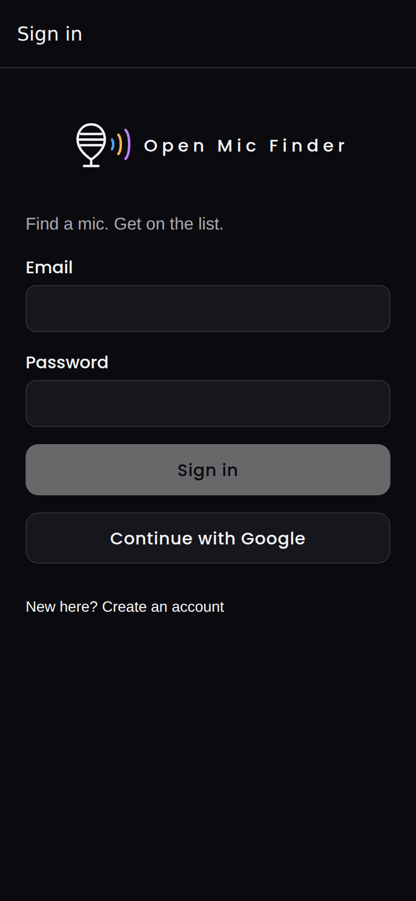
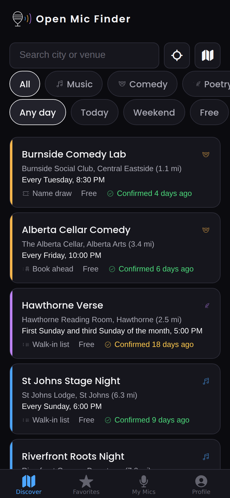
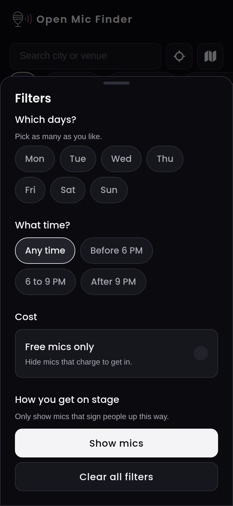
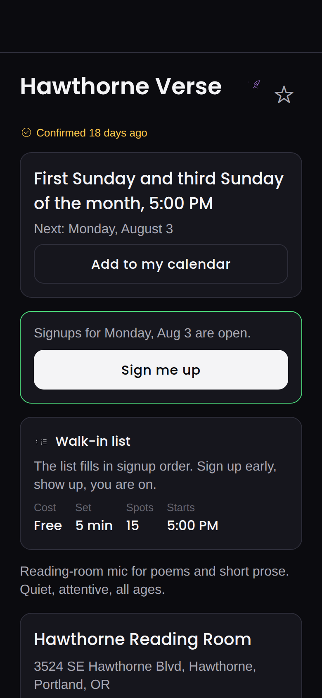
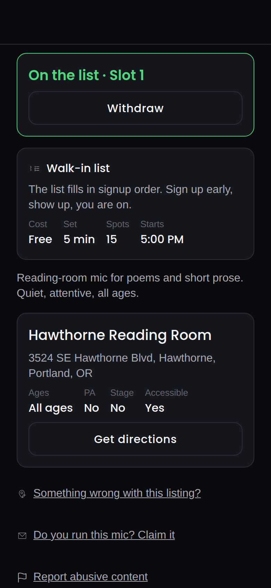
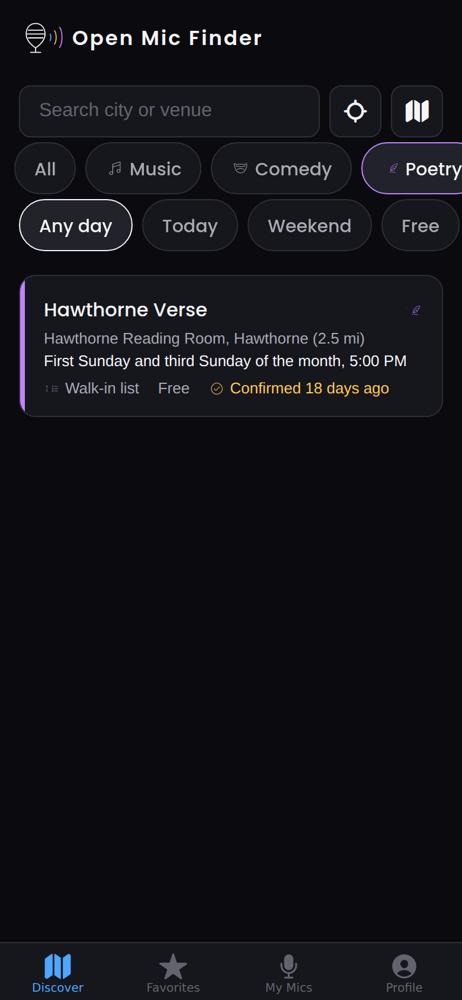
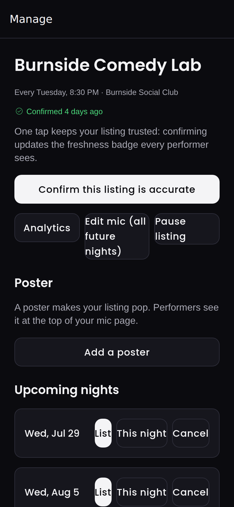
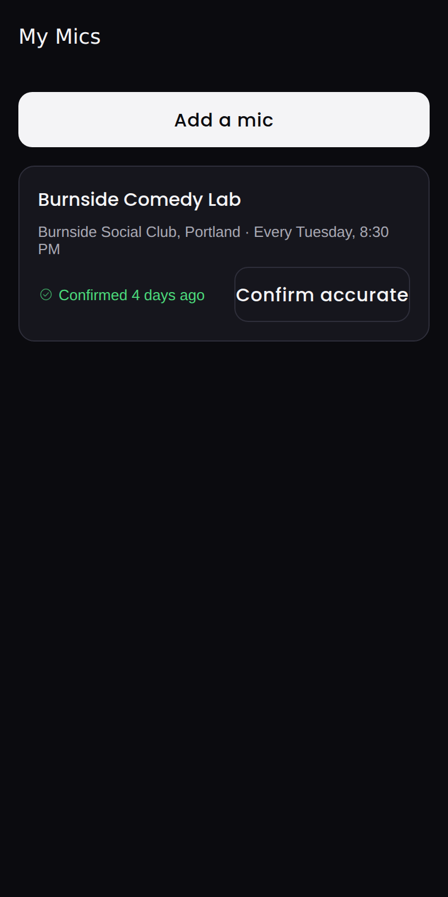
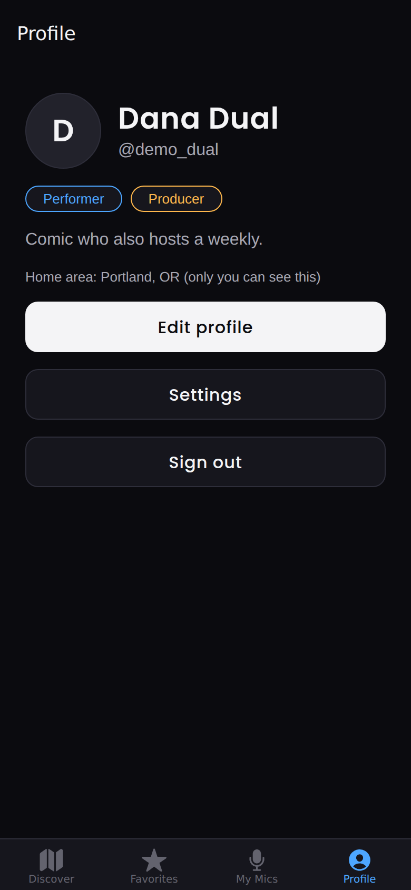

# Open Mic Explorer: Investor Pitch

Find a mic. Get on the list.

One app that puts every open mic (music, comedy, and poetry) on one map, and takes a performer from "what is happening Tuesday near me" to "I am on the list" without leaving the app.

All screenshots in this document are captured from a real build of the app (2026-07-29) running against the real database and seed data. Nothing here is a mockup.

---

## 1. The problem

Open mics are the farm system of live entertainment. Every touring comic, working songwriter, and slam poet started at one. Yet the tooling around them is broken in three specific ways:

1. **Listings rot.** The best-known mobile app in this space died because its listings went stale and user corrections went nowhere. A performer who drives 40 minutes to a cancelled mic deletes the app that sent them there. Freshness is not a feature, it is the product.
2. **Discovery and signup are two different tools.** Performers find mics on stale web directories and Facebook posts, then sign up through a separate service, a DM, or a paper list. The handoff loses people on both sides.
3. **Every competitor is single-discipline.** Comedy apps ignore music. Music directories ignore comedy. Poetry, one of the largest and fastest-growing spoken word scenes, has effectively no dedicated tooling at all.

The people running these nights have it worst: a host managing a 25-name lottery from a paper list at 10 PM, while also emceeing, is the norm today.

## 2. The product

Open Mic Explorer is a two-sided mobile app, shipping to the Apple App Store and Google Play, with one account covering both sides of the mic. That mirrors how real scenes work: the person performing on Tuesday is often the person hosting on Wednesday.

<table>
<tr>
<td width="33%"></td>
<td width="33%"></td>
<td width="33%"></td>
</tr>
<tr>
<td>Dark-first interface, built for people checking their phone in the back of a bar.</td>
<td>Every mic in town in one scannable list: discipline color coding, distance, plain-English schedule, cost, and a trust badge on every card.</td>
<td>Filters written in plain language: which days, what time, cost, and how you get on stage.</td>
</tr>
</table>

### The freshness flywheel (why our listings do not rot)

Every listing carries a "last confirmed" badge that performers see before they leave the house: green within 14 days, amber to 45, gray after that. Confirming is one tap for the producer and the timestamp is server-stamped, so the badge cannot be faked. Performers can flag a listing as wrong or dead in two taps. Producers keep their badge green because a green badge is what fills their room. That loop is the moat: the incumbent died precisely because it had no one with an incentive to keep data true.

### From found to on the list in two taps

<table>
<tr>
<td width="33%"></td>
<td width="33%"></td>
<td width="33%"></td>
</tr>
<tr>
<td>The listing answers everything: next night, how signups work, cost, set length, venue accessibility, directions, and add to calendar.</td>
<td>Signup happens in-app. Walk-in lists confirm instantly with a slot number; lottery mics enter you in the draw. Status changes arrive as push notifications.</td>
<td>Music, comedy, and poetry are first class from the database schema to the map markers. Poetry is an almost entirely unserved scene.</td>
</tr>
</table>

### Producer tools: run the night from the side of the stage

<table>
<tr>
<td width="33%"></td>
<td width="33%"></td>
<td width="33%"></td>
</tr>
<tr>
<td>List a mic in about two minutes with a plain-language schedule builder. One tap keeps the listing confirmed. Cancel a night with a reason performers actually see.</td>
<td>The night-of list, live: lottery draw with visible randomization, drag to reorder, on-deck announcements, performed and no-show tracking, all updating in real time on every phone in the room.</td>
<td>Every mic a producer runs, with its freshness state, in one place.</td>
</tr>
</table>

## 3. Why now, and why we win

- **The incumbent is gone.** The category's mindshare app collapsed under stale data. The audience still exists and still has the problem; nobody has rebuilt trust.
- **Joined discovery and signup is the wedge.** Whoever owns the signup list owns the night. Competitors do one or the other; we close the loop, which makes both sides sticky.
- **Multi-discipline widens every city.** Three scenes per city means three seeding communities, three word-of-mouth networks, and roughly triple the listing density of any single-discipline rival on day one.
- **Two-sided lock-in compounds.** Performers go where the listings are accurate. Producers list where the performers are. Each city that tips becomes very hard to dislodge.

## 4. Market

Sizing is bottom-up from scene density, stated as estimates.

| Layer                   | Estimate           | Basis                                                                                                                                                                                                                   |
| ----------------------- | ------------------ | ----------------------------------------------------------------------------------------------------------------------------------------------------------------------------------------------------------------------- |
| Recurring open mics, US | 15,000 to 25,000   | Mid-size metros sustain 30 to 80 recurring mics across the three disciplines; large metros sustain 150 to 300. Roughly 120 metros with a meaningful scene.                                                              |
| Producers (hosts)       | one or two per mic | The paying side. Each mic has at least one person with the list-management problem every single week.                                                                                                                   |
| Active performers, US   | 1M+                | Regulars per mic run 20 to 100 across weekly cycles; performers attend multiple mics. Comedy alone supports tens of thousands of active amateurs; music is several times comedy; spoken word is large and undercounted. |
| International           | 2 to 3x US         | English-speaking markets (UK, Canada, Australia, Ireland) have dense comparable scenes and the same tooling gap.                                                                                                        |

The performer side is deliberately free forever, because performer density is what producers pay for.

## 5. Business model

The launch build is deliberately free end to end: every feature is free to every account, and no payment SDK ships in v1 (owner decision recorded 2026-07-30 in ARCHITECTURE.md). The full monetization stack (RevenueCat wrapping StoreKit and Google Play Billing, fail-closed entitlement checks, a review-compliant paywall with Restore Purchases) was built and verified in this codebase and then removed from the launch build rather than left dormant, for two reasons: a dormant paywall is a liability at App Store review, and free producer tools are what tip a city. The stack lives in git history; turning Producer Pro on is a restore of already-written, already-reviewed code plus store product configuration, not new engineering.

<table>
<tr>
<td width="50%"></td>
<td width="50%"></td>
</tr>
<tr>
<td>One account, both roles. The performer-to-producer upgrade path lives inside the product itself. Listing a mic, confirming accuracy, and cancelling nights stay free for every producer forever, because fresh listings are the whole point.</td>
<td></td>
</tr>
</table>

### Revenue line 1: Producer Pro (built and shelved for launch; first to re-enable)

Subscription for the people running the night. Free: listing, one-tap confirm, cancellations, read-only roster. Pro: signup list management (lottery draws, reorder, waitlist promotion, performed and no-show tracking), realtime stage-side updates, on-deck push announcements, and listing analytics.

- Proposed price: $9.99 per month or $79.99 per year (prices configured in the stores, not hardcoded; A/B testable via RevenueCat offerings once re-enabled).
- Store fee at our scale: 15% under both stores' small business programs. Net roughly $8.49 per monthly sub.
- Producer churn is structurally low: the mic recurs every week, and the tool replaces a paper list the host hates. This behaves like prosumer SaaS, not consumer subscription.

### Revenue line 2: venue and promotion (natural extension, not built yet)

Once a city tips, the venue side opens up: featured placement for a venue's mics, promoted "new mic" launches, and multi-mic dashboards for venues or promoters running several nights. Priced as B2B, sold to businesses that already spend on filling weeknights.

### Revenue line 3: paid-slot rails (optional, later)

Some reserved-slot mics already charge performers. V1 states the cost and keeps payment at the venue (fully App Store compliant). A later version can process reservations for a take rate, off-app where policy requires, once volume justifies it.

### What stays free forever

Discovery, signup, and performing. A paywall on performers would kill the density that makes producers pay.

## 6. Revenue potential

Assumptions: $9.99 monthly / $79.99 annual blended to roughly $100 per producer per year gross, 15% store fee, one paying producer per converted mic. Conversion applies to claimed, active mics (a mic whose producer uses the roster weekly).

|                                     | Year 1                | Year 2 | Year 3 |
| ----------------------------------- | --------------------- | ------ | ------ |
| Metros live                         | 3 (Pacific Northwest) | 12     | 40     |
| Listed mics                         | 1,200                 | 6,000  | 16,000 |
| Claimed by an active producer       | 600                   | 3,300  | 9,600  |
| Producer Pro conversion             | 20%                   | 25%    | 30%    |
| Paying producers                    | 120                   | 825    | 2,880  |
| Producer Pro ARR (net of store fee) | $10K                  | $70K   | $245K  |
| Venue and promotion revenue         | 0                     | $15K   | $120K  |
| Total ARR                           | ~$10K                 | ~$85K  | ~$365K |

Year 1 is deliberately small: it is a density-building year in one region, and the numbers above are the conservative case. The upside case (faster city expansion, 35%+ conversion in tipped cities, international English-speaking markets, and paid-slot rails) supports a $1M+ ARR path on the same product. The cost base stays light throughout: serverless backend (Supabase), no content licensing, no inventory, and gross margin above 80% after store fees and infrastructure.

The honest framing: this is not a market you win with ad spend, it is a market you win city by city with data quality. The prize for winning it is the default operating system for live amateur performance, the layer every venue, promoter, and performer touches weekly, in a category with no funded competitor and a graveyard where the last incumbent stood.

## 7. Go-to-market

City-by-city, seeding the supply side first. This is already operationalized in the product:

1. **Seed listings manually per metro.** The admin import path and bulk-entry tooling required for this exist in the codebase; the Pacific Northwest seed (20 mics across all three disciplines) ships with the repo.
2. **Claim flow converts listings into producers.** Every seeded listing shows "Do you run this mic? Claim it." Claiming has an admin verification step (built) and hands the producer free tools that are genuinely better than their paper list.
3. **Producers recruit performers for us.** A host with a signup list in the app tells the room to get on the list. Every mic night is a live demo to 20 to 100 exactly-right users.
4. **Performers spread it across mics.** Performers attend multiple mics and ask the hosts who are not on it yet why signups are still on paper.

CAC is field labor and community management, not paid acquisition.

## 8. Where the product stands today

This is not a deck describing a future app. Phases 0 through 8 of the build plan are complete and the codebase is store-submission ready pending owner accounts and credentials:

- Full schema with PostGIS geosearch, 32 tables, row level security on every table, 806 database test assertions plus 554 app tests passing (verified 2026-08-11).
- Discovery (map and list), plain-language filters, search, personalized defaults around a private home area.
- Signups end to end: walk-in lists, visible lottery draws, waitlists, realtime roster, push notifications, on-deck announcements.
- Producer suite: two-minute listing builder, one-tap freshness confirmation, this-night-only vs all-future edits, cancellations with reasons, posters, analytics.
- Trust and compliance built to Apple's 2026 UGC enforcement: EULA gate, report and block enforced server side, automated content filter, moderation queue with 24-hour target, two-tap account deletion, age gating, privacy manifests. This is a moat against small competitors in its own right: most indie apps in this category cannot get through review.
- Monetization deliberately out of the launch build: the Producer Pro stack was built, verified, and then removed so v1 ships free with one fewer review surface. Re-enabling it is a code restore plus store product setup, not a build.
- EAS build profiles, store listing copy, and a launch checklist (docs/LAUNCH-CHECKLIST.md) are in the repo.

Remaining before the stores: hosted Supabase project, Apple and Google developer accounts, provider credentials, final art, and the TestFlight and Play internal testing cycle. That is configuration and review time, not engineering risk.

## 9. The ask

Raising a pre-seed round to get from store-ready to city-proven:

| Use of funds                    | Purpose                                                                           |
| ------------------------------- | --------------------------------------------------------------------------------- |
| Launch operations               | Store accounts, hosted infrastructure, submission cycle, first OTA update cadence |
| Seeding and community, 3 metros | Field seeding of listings, producer onboarding, scene partnerships                |
| Design and platform polish      | Final art, native map refinement, tablet screenshots, accessibility passes        |
| Runway                          | 12 to 18 months to demonstrate the density-to-conversion loop in one region       |

The milestone this round buys: one region where the majority of active mics are listed, fresh, and claimed, with Producer Pro conversion data that makes the Series A math legible.

---

_Screenshots captured 2026-07-29 from the app running against the seeded development database, before the rename to Open Mic Explorer and the removal of the paywall. Demo data shown (mic names, venues, performers) is the repo's Pacific Northwest seed set._
